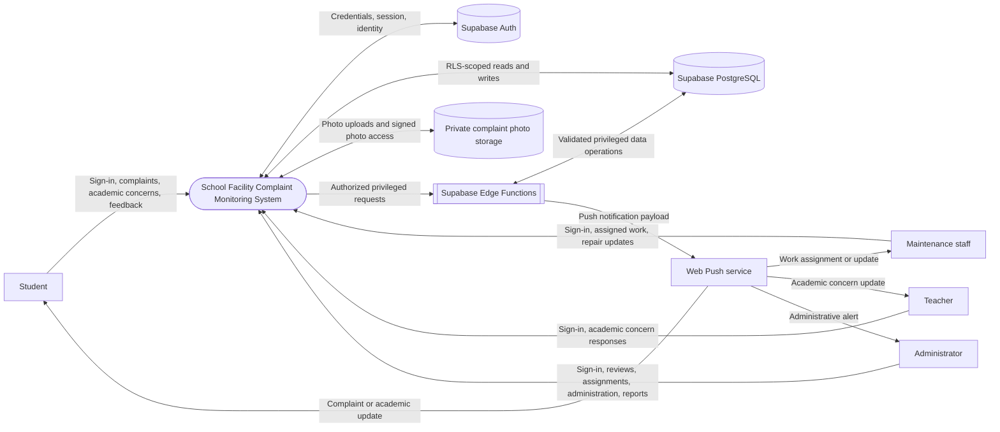
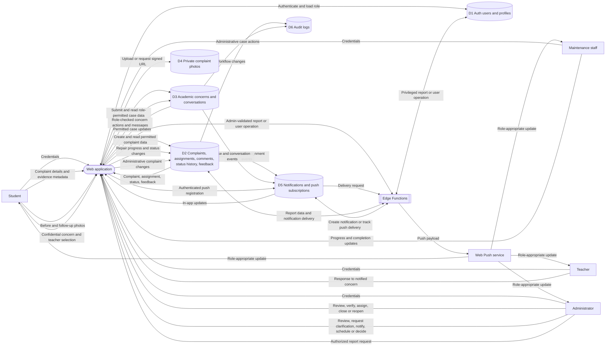

# Data Flow Diagram

## Level 0: System Context

The web client communicates directly with Supabase. PostgreSQL Row Level Security (RLS) scopes authenticated data access; trusted Edge Functions handle privileged operations.

## Level 1: Main Data Flows

## Data Handling Notes

- Authentication is managed by Supabase Auth; the application reads the matching profile to determine the portal role.
- The browser uses the publishable key. RLS policies authorize database reads and writes for the signed-in user; administrative Edge Functions validate the caller before using privileged access.
- Complaint images are stored as private objects. PostgreSQL stores their metadata and storage paths; authorized users receive temporary signed URLs.
- Complaint status history, assignments, feedback, academic messages, notifications, and audit records are persisted in PostgreSQL. Realtime changes update subscribed views.
- The Edge Functions support protected administration and reporting, manual complaint notifications, and web-push delivery. They do not replace the normal RLS-scoped browser-to-database path.